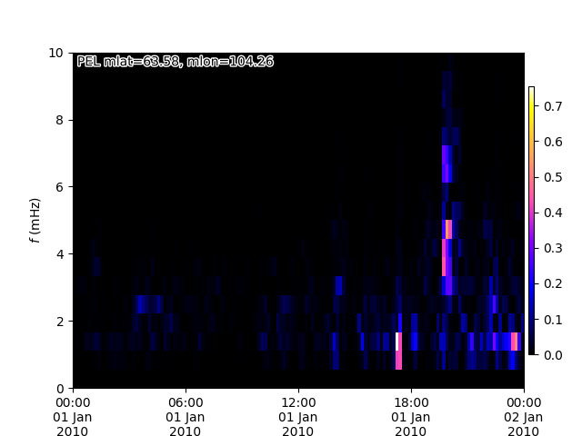
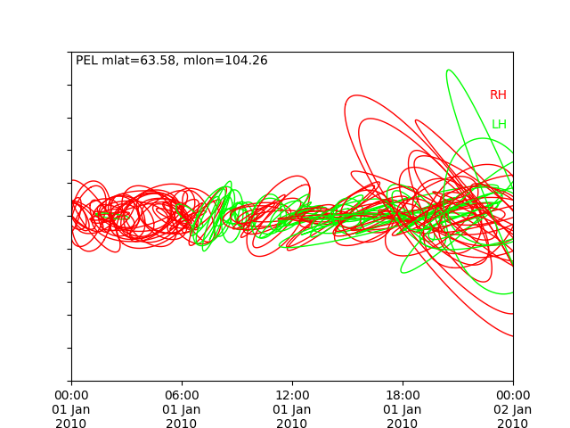

# gmagfft
Ground magnetometer FFT.

## Install 

This package should be built as a wheel or source package.

Firstly, clone and enter the cloned directory:

```bash
git clone git@github.com:mattkjames7/gmagfft.git
cd gmagfft
```

To build as a wheel:

```bash
python3 setup.py bdist_wheel
pip3 install dist/gmagfft-0.0.1-py3-none-any.whl
```

Or as source package:
```bash
python3 setup.py sdist
pip3 install dist/gmagfft-0.0.1.tar.gz
```

Set `$GMAGFFT_PATH` to point to a directory which will contain cross-phase data
and profiles for configuring the package. This can be done in `~./bashrc`, e.g.:
```bash
export GMAGFFT_PATH=/path/to/fft
```


## Usage

### Profiles

Profiles are used to define the FFT/STFT parameters, the defaults are stored
in a `dict` below:
```python
parameters = {
    'name' : 'default',             #name of the profile
    'method' : 'fft',               # 'fft' or possibly 'ls'
    'window' : 1800.0,              # window size in seconds
    'slip' : 600.0,                 # how far the window moves in seconds
    'freq0' : 0.0,                  # lowest frequency to keep (Hz)
    'freq1' : 0.1,                  # highest frequency to keep (Hz)
    'detrend' : 2,                  # order of polynomial to detrend with
    'lowPassFilter' : 0.0,          # low pass frequency cutoff
    'highPassFilter' : 0.0,         # high pass frequency cutoff
    'windowFunc' : 'none',          # name of window function, e.g. "hann"
}
```

A new profile can be created using `gmagfft.profile.create()`, e.g.:
```python
# create a new profile based on default
gmagfft.profile.create("profile0",slip=400.0)

# or a completely new one
parameters = {
    'name' : 'profile1',           
    'method' : 'fft',             
    'window' : 3600.0,             
    'slip' : 1200.0,               
    'freq0' : 0.001,            
    'freq1' : 0.020,              
    'detrend' : 1,                
    'lowPassFilter' : 0.02,       
    'highPassFilter' : 0.001,   
    'windowFunc' : 'hann',     
gmagfft.profile.create(**parameters)
```

Obtain the parameters of an existing one by name:
```python
params = gmagfft.profile.read("profile0")
```

Set the current profile to use:
```python
gmagfft.profiles.use("profile1")
```

Retrieve the profile currently in use:
```python
parameters = gmagfft.profiles.get()
```


### Saving and Reading 3D FFT Spectra

Saving and reading FFTs uses the currently loaded profile. Both methods
take the following arguments:
 - `Date` : date in the format `yyyymmdd`
 - `stn` : magnetometer station code

For saving the FFT output:
```python
gmagfft.data.saveSpec(20100101,"pel")
```

To read it:
```python
fftobj = gmagfft.FFTCls(20100101,"pel")
```
where `fftobj` is an instance of `FFTCls` which contains methods for 
plotting spectra and input data. An example is using `plot()`:

```python
fftobj.plot("xPow",flim=[0.0,10.0])
```

which should produce a plot like this:



Or we could plot the polarization ellipses at the frequency of the peak
wave power in each spectrum using `plotPol()`:

```python
fftobj.plotPol(Comp="x")
```

which produces the mess below (this can be really nicely organised when used
on data containing fairly obvious waves)
